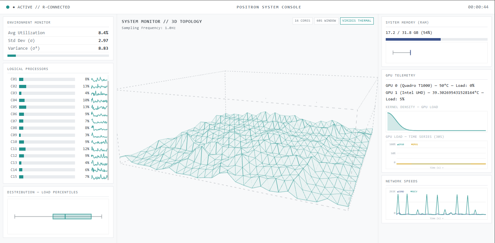

# Task Manager 3D Visualize (Positron & Tidyverse Aesthetic)
<!-- Chèn Badge (Huy hiệu) hoặc Ảnh Banner đại diện ở đây nếu có -->


Giám sát hiệu năng hệ thống (CPU/RAM/GPU/Network) theo thời gian thực và hiển thị dạng **3D Topology (time-series surface)** theo phong cách Light Theme của Positron, kết hợp cảm giác “Tidyverse/ggplot-like” trong phần biểu đồ thống kê.

## Tính năng nổi bật (Features)

* **Backend (Python + WebSocket Server):** Thu thập metrics theo chu kỳ **1Hz** bất đồng bộ bằng `asyncio`, `psutil` và tùy chọn GPU qua `GPUtil`.
* **Frontend (Three.js):** Render **lưới bề mặt 3D** mô tả biến động theo thời gian cho **16 logical cores** trong cửa sổ lịch sử.
* **Làm mịn chuyển động (anti-jitter):** Dữ liệu 1Hz được nội suy bằng Lerp (alpha = `0.1`) để animation mượt ở ~60FPS.
* **Thống kê trực tiếp:** Tính nhanh **trung bình (μ / avg)**, **độ lệch chuẩn (σ)** và **phương sai (σ² / variance)** để điều khiển sidebar & biểu đồ.
* **KDE density (Kernel Density Estimation):** Vẽ phân phối mật độ cho GPU load trong panel bên phải.
* **Boxplot + Sparkline:** 
  * Boxplot cho phân phối load hiện tại (cores / RAM usage window)
  * Sparkline hiển thị xu hướng ngắn cho từng core
* **Mock Telemetry fallback:** Nếu backend WebSocket chưa sẵn sàng/không kết nối được, frontend tự chạy dữ liệu giả để vẫn hiển thị demo.

## 🛠️ Công nghệ sử dụng (Tech Stack)

* **Frontend:** HTML/CSS/JavaScript, **Three.js**, **Plotly.js**, `OrbitControls`
* **Backend:** **Python 3**(`asyncio`, `psutil`, `websockets`, `GPUtil`)
* **WebSocket contract:** JSON payload với các trường `cpu_detail.cores[]`, `memory_detail`, `gpu_detail[]`, `network_speed`

## 📸 Hình ảnh minh họa (Screenshots / Demo)



## Hướng dẫn cài đặt (Installation)

### 1. Chuẩn bị môi trường Python

Cần Python từ bản 3.0 trở lên và pip.

### 1.1 Chọn Interpreter

* Ctrl + Shift + P

* Gõ: "Select: Interpreter"

* Chọn bản Python phù hợp

### 1.2 Cài đặt thư viện cần thiết

```python
# 1. Cài dependencies
pip install -r requirements.txt
```

Nếu `GPUtil` không có hoặc không detect được GPU, backend sẽ trả về GPU metrics = 0 (frontend vẫn hoạt động bình thường).

## Cách sử dụng (Usage)

### 1. Khởi chạy backend WebSocket

Backend chạy endpoint:

* `ws://127.0.0.1:8080`
* Sampling: **1 Hz**

Chạy:

```bash
python app.py
```

### 2. Mở frontend

Mở `index.html` bằng trình duyệt để xem task chạy.

> Gợi ý: Bạn có thể nạp **cả thư mục** (đảm bảo đường dẫn `libs/` và `style.css`, `main.js`) vào Lively Wallpaper để làm hình nền động.

## Đóng góp (Contributing)

Mọi đóng góp từ cộng đồng đều được trân trọng! Hãy làm theo các bước sau:

1. Fork dự án này.
2. Tạo nhánh tính năng mới (`git checkout -b feature/AmazingFeature`).
3. Commit thay đổi của bạn (`git commit -m 'Add some AmazingFeature'`).
4. Push lên nhánh vừa tạo (`git push origin feature/AmazingFeature`).
5. Mở một Pull Request.

## 📄 Giấy phép (License)

Dự án này được phân phối dưới giấy phép MIT License. Xem chi tiết tại file `LICENSE`.
